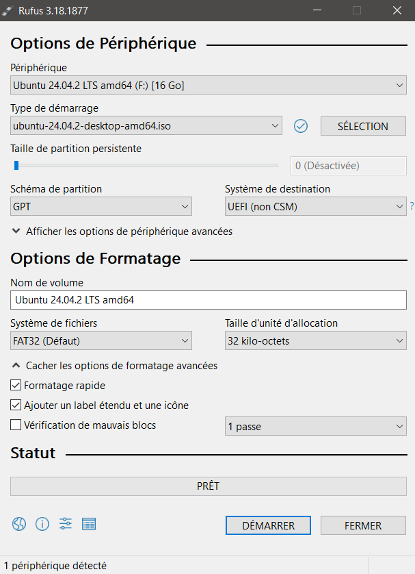
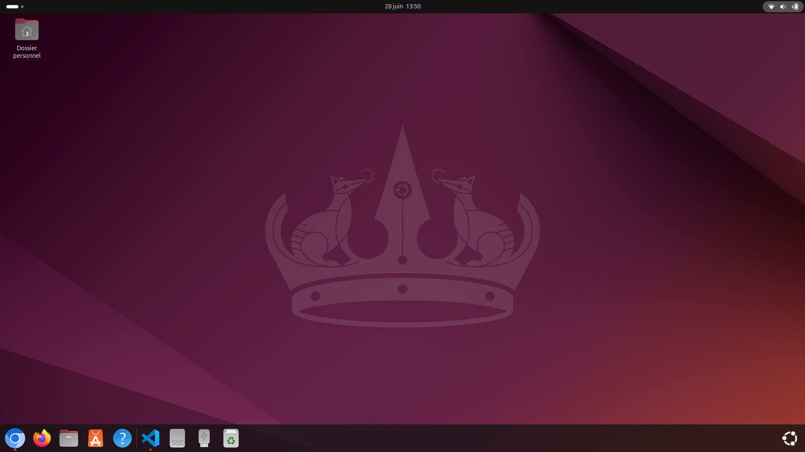

# 📍 Feuille de Route - Projet Arvix

### Explications

  Cette Feuille de Route suit le l'installation chronologique d'ArviX (Assistant de Routines Virtuelles Intelligent) sur une machine linux Ubuntu 24.04 en dual Boot avec Windows 10. Puis la configuration personnalisée de l'interface graphique avec Hyprland et l'integration d'un assistant IA capable d'intéragir avec le système. 

## Étape 1 : Installation Ubuntu

- [X] Partition du disque.

  Si vous partez de zero, sans linux installé utilisez d'abord le [Gestionnaire de disque Windows](https://support.microsoft.com/fr-fr/windows/gestion-des-disques-dans-windows-ad88ba19-f0d3-0809-7889-830f63e94405) pour liberer l'espace néssessaire au nouveau système d'exploitation (je prends 100Gio - c'est largement suffisant pour notre utilisation). Si vous possédez déja linux passez directement à l'Étape 2.

- [X] Sauvegarder les données.

  Pour sauvegarder vos données vous pouvez au choix, copier vos données importantes (sur un disque externe ou sur le cloud) ou bien faire un “snapshot” de votre machine.

- [x] Télécharger une iso de Ubuntu.
  
  J’utilise [Ubuntu 24.04](https://releases.ubuntu.com/24.04.2/ubuntu-24.04.2-desktop-amd64.iso) qui est très stable et Open Source, ce sera la base de notre système d’exploitation customisé.

- [x] Créer une clé USB bootable
  
  On peut utiliser l’utilitaire [rufus](https://rufus.ie/fr/) pour créer la clé USB bootable.

> [!WARNING]  
>Rufus formate la clé, donc supprime toutes les données présentes. 

  Voici mon paramétrage:

<p align="center">  
    
</p>

- [x] Installer Ubuntu 24.04 en dual boot.

  Il faut ensuite redémarrer sur la clé bootable.  
  (Windows 10)  Paramètres>Mise à jour et securité>Récupération>Redémarrage Avancé>Utiliser un Périphérique>USB Device>Install Ubuntu

### Tutos détaillés:

  Voici 2 tutos qui détaillent l’installation de Linux en Dual Boot:  
  [Le crabe info](https://lecrabeinfo.net/tutoriels/installer-ubuntu-24-04-lts-en-dual-boot-avec-windows/)  
  [IT-Connect](https://www.it-connect.fr/tuto-dual-boot-windows-et-linux-ubuntu-installation-sur-pc/)

- [x] Config Système.
 
   Choisir la partition que vous avez liberée.
   Vous pouvez ensuite procéder à l’installation et la configuration de votre choix (voir les tutos détaillés).

> [!WARNING]  
> Lors du choix du partitionnement faites attention à ne pas formater les partitions liées à Windows. Il est possible de créer de nouvelles partitions ou de cocher directement l'option "dual boot".


- [x] Mettre à jour le système.
  
  Il vaut mieux mettre à jour le système si des mises à jour sont proposées. ( Personnellement je désactive les mises à jour automatiques pour éviter des changements qui pourraient casser ma configuration).

> [!NOTE]  
> 🍿 L'installation peut prendre longtemps selon les PC (+ de 20 min pour moi). Si vous êtes connecté à Internet beaucoup de paquets peuvent être installé à ce moment-là.

## Étape 2 : Installer les Applications et Utilitaires.

- [x] Installer toutes les applications de votre choix.

> [!NOTE]  
> La configuration par défaut d'ArviX pourrait ne pas fonctionner si vous n'avez installé les mêmes applications que moi. Il suffira de remplacer les nom des programmes  que vous n'avez pas par un equivalent dans le fichier `arvix.conf`.

  Beaucoup d'apps sont disponibles sur le store "App Center" , mais vous pouvez aussi les télécharger depuis Internet.
  Pour une utilisation quotidienne de mon PC j'installe donc toutes mes applications favorites : Discord, Spotify, Steam, Libre Office, Firefox, Chrommonium, Visual Studio Code, PyCharm, Bitcoin, Gimp, VLC, Unreal ...

  Voilà le systeme est prêt : 
<p align="center">  
    
</p>


###  Préparation et utilitaires nécessaires

- [] Installer Git, Curl, Wiget, Zsh
```shell
apt update && sudo apt upgrade
sudo apt install git curl wget zsh
```

- [] Cloner le répertoire git:

```shell
git clone https://github.com/Doritos-Man/Arvix
```


##  Étape 3 : Hyprland  

 Il est recommender de lire la documentation d'Hyprland sur le [site officiel](https://wiki.hypr.land/Getting-Started/Installation/) pour comprendre et maitriser votre configuration.

Il est possible d'utiliser les paquets ubuntu d'hyperland `sudo apt-get install -y hyprland`ou d'utiliser des scripts disponibles sur github pour compiler Hyprland et les dependances:

```shell
git clone https://github.com/adi1090x/hyprland-ubuntu
cd hyprland-ubuntu
chmod +x install.sh
./install.sh
```

...
